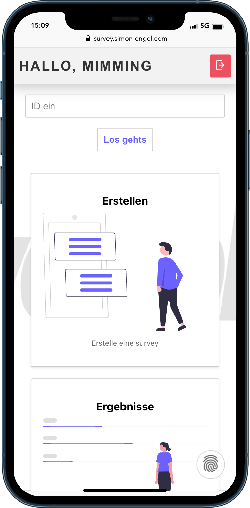

# Surveysphere - Technische Dokumentation

<!--  -->

## Struktur und Aufbau der Website

### Willkommensseite
Das ist die erste Seite, auf die der Nutzer geleitet wird, wenn er die Website besucht. Hier erfolgt eine Erklärung, wie die Applikation zu bedienen ist, damit der Nutzer weiß, was zu tun ist. Von dieser Seite kann auf die Anmelde-Seite navigiert werden.

### Anmelde-Seite
Auf dieser Seite kann der Nutzer sich entweder anmelden, wenn er schon eine Account hat, oder einen neuen Account erstellen. Unabhängig davon, ob der Nutzer sich anmeldet oder registriert, wird er danach auf die Übersichtsseite geleitet.
Die Seite ist simpel aufgebaut: Zentral ist die Komponente, in der mit Textfeldern Informationen eingegeben werden. Über einen Link am unteren Ende der Komponente kann zwischen Anmeldung und Registrierung gewechselt werden. Unter den Textfeldern ist ein Knopf, durch den die Anmelde- oder Registrierung ausgeführt werden kann.

### Übersichtsseite
Diese Seite stellt den zentralen Bedienpunkt der Anwendung dar. Von hier aus gibt es verschiedene Dinge, die der Nutzer tun kann. Die Eingabe der ID einer Umfrage ist möglich, darauf folgt eine Navigation auf die Antwortseite. Außerdem ist es möglich, auf die Erstellseite und die Ergebnisseite zu navigieren.

### Antwortseite
Auf dieser Seite ist es dem Nutzer möglich, seine Antworten zu einer Umfrage einzugeben. Die Umfrage kann entweder abgebrochen oder abgeschickt werden. In beiden Fällen erfolgt eine Navigation zurück auf die Übersichtsseite.

### Erstellseite
Diese Seite dient dem Erstellen von neuen Umfragen. Es kann ein Titel eingegeben und Antworten hinzugefügt werden. Es ist möglich, beliebig viele Fragen und zu jeder Frage Antwortmöglichkeiten hinzuzufügen. Damit die Umfrage hochgeladen werden kann, muss jede hinzugefügte Frage und Antwortmöglichkeit ausgefüllt werden. Nach dem erfolgreichen Erstellen wird auch wieder zurück auf die Übersichtsseite geleitet.

### Ergebnisseite
Auf dieser Seite können die Ergebnisse von erstellten Umfragen eingesehen werden. Dafür gibt es zuerst eine Liste, die alle selbst erstellten Umfragen enthält. Bei Auswahl einer dieser Umfragen wird weiter auf die eigentliche Seite mit den Ergebnissen navigiert, auf der zu jeder Frage die Verteilung der Antworten eingesehen werden kann.

## Frontend
Das Frontend der Applikation wird grundsätzlich mit ReactJS aufgebaut. Für jede Seite, die auf der Website angezeigt wird, gibt es einen eigenen Ordner, indem für die Seite das HTML aufgebaut und das CSS gespeichert wird. Dabei ist ReactJS grundsätzlich Komponenten-basiert aufgebaut: Für jede Seite gibt es eine Komponente im Ordner *pages* und Komponenten, die in mehreren Seiten verwendet werden, wie zum Beispiel Buttons, sind im Ordner *components* zu finden. React-Komponenten sind Funktionen, die HTML-Code zurückgeben. Unser selbstgeschriebener HTML-Code kann am Ende jeder JavaScript-Datei gefunden werden. Zu jeder Komponente gibt es eine gleichnamige css-Datei, die in dieser importiert wird. 

### Technischer Aufbau
Anhand des Login-/ Signup-Prozesses kann der technische Aufbau der Seiten gut illustriert werden. Über alle Seiten hinweg werden sogenannte Hooks eingesetzt. In React ermöglich Hooks, dass Komponenten zusätzliche Funktionalitäten erhalten. Der meistgenutze Hook ist der sogenannte *useState*-Hook: Mit diesem kann der Zustand in den funktionalen Komponenten verwaltet werden (*State Management*). So können Zustandsvariablen erstellt und aktualisert werden, der Hook gibt auperdem eine Funktion zurück, um den Zustand zu aktualisieren. Dadurch können bei jeder Zustandsänderung die von der Veränderung betroffenen Teile der UI mit dem aktualisierten Zustand neu gebaut werden. Dieser Hook wird beim Login genutzt, um die Inhalte der Textfelder auszulesen und die sich daraus ergebenden Zustandsvariablen zu verarbeiten. Außerdem wird über einen *useState*-Hook gespeichert, ob der Nutzer sich im Login- oder Signup-Modus befindet. Dieser Modus kann über die jeweilige Schaltfläche geändert werden ("Registieren"/"Login"). Befindet der Nutzer sich im Registrieren-Modus, werden zwei zusätzliche Textfelder sichtbar, indem die Zustandsvariable überprüft wird: Ein Feld für die Passwortwiederholung sowie ein Feld für den Nutzernamen.

Beim Einloggen bzw. Registrieren wird eine Anfrage an das Backend gesendet: Alle diese Anfragen befinden sich im *api*-Ordner. Zum Senden der Requests wird das npm-Paket [axios](https://www.npmjs.com/package/axios) verwendet, da dieses einfach und schnell zu benutzen ist. Der Aufruf der Methoden im *api*-Ordner erfolgt immer in einem try-catch-Block: Tritt bei der Anfrage ein Fehler auf, kann entsprechend des HTTP-Codes, der vom Backend gesendet wird, ein Fehler angezeigt werden. Beim Login sind dies zum Beispiel ein 404, wenn die E-Mailadresse nicht gefunden wurde oder ein 401 bei falscher Passworteingabe.

Nach erfolgreicher Antwort vom Server wird auf die Übersichtsseite geleitet. Um das Routing innerhalb der Applikation zu gewährleisten, wird das npm-Paket [React Router](https://www.npmjs.com/package/react-router-dom) verwendet. In der Datei App.js wird zunächst ein Router erstellt, bevor die einzelnen Routen angelegt werden können. Jeder URL kann eine React-Komponente zugewiesen werden, die bei Aufruf der URL angezeigt wird. Auch für den Fall, dass eine URL unbekannt ist, kann eine Komponente angezeigt werden, in unserem Fall ein klassisches 404-Bild. Um aus React eine Route aufzurufen, wird erneut ein Hook benutzt, genauer der *useNavigate*-Hook, dem eine URL übergeben werden kann, auf die geroutet werden soll.

Zum globalen State-Management der Applikation wird [React Redux](https://react-redux.js.org/) verwendet. Dabei handelt es sich grundsätzlich um einen Container, in den Daten geschrieben werden können, auf die von überall zugegriffen werden kann. In der *index.js*-Datei, dem Einstiegspunkt der Applikation, wird der Store konfiguriert und hinzugefügt, sodass er allen Komponenten der Applikation zur Verfügung steht. Die Daten des Stores werden über sogenannte *Actions* verändert, die dispatched werden können. Nach erfolgreichem Login wird die Login-Action aufgerufen und einige Daten übergeben. Das Aufrufen der Actions erfolgt wieder über einen Hook, der von Redux zur Verfügung gestellt wird. Die Action wird mit mehreren Paramtern aufgerufen, wie dem Nutzernamen oder einem Token, welche dann in den Store geschrieben werden. Über den *useSelector*-Hook ist es in jedem Teil der Applikation möglich, auf die Daten des Stores zuzugreifen.

#### Darstellung der Ergebnisse
Zu den zentralen Anforderungen an die Applikation gehört die visuell ansprechende Darstellung der Umfrageergebnisse. Um diese einfach zu gestalten, ist die Wahl auf ein weiters npm-Paket für React gefallen, [ChartJS](https://www.npmjs.com/package/chart.js?activeTab=readme). Die Ergebnisse jeder Frage werden in der Komponente ResultCard angezeigt, in der entsprechend der Anzahl der Antwortmöglichkeiten die Visualisierung der Ergebnisse in einem Säulendiagramm erfolgt.

## Backend
Das Backend ist grundsätzlich mit NodeJS aufgebaut, als Framework zur einfacheren Entwicklung wird [express](https://www.npmjs.com/package/express) verwendet. Als persistente Datenbank ist die Wahl auf [MongoDB](https://www.mongodb.com/de-de) gefallen, da diese schnell mit NodeJS zu verbinden und für Testzwecke kostenlos zu nutzen ist. Zum simplen und unkomplizierten Zugriff auf die Datenbank aus dem Quellcode heraus wird [Mongoose](https://www.npmjs.com/package/mongoose) verwendet.

### Modells
Mongoose sieht es vor, für Datenbankeinträge sogenannte Schemata zu erstellen, um eine konsistente Datenhaltung zu gewährleisten. Die Schemata unserer Applikation sind im *models*-Ordner zu finden, es gibt ein Schema für eine Umfrage und ein Schema für einen Nutzeraccount. Hier ist festgelegt, welche Attribute die Datenbankeinträge enthalten müssen und was für einen Datentypen sie darstellen. Außerdem kann festgelegt werden, welche Attribute zwingend erforderlich sind, um bei der späteren Verarbeitung Fehler vorbeugen zu können.

### Routes
Um den Quellcode übersichtlicher zu gestalten, wird die Möglichkeit von Express genutzt, Routen auszulagern. In der index.js wird auf die Routen verwiesen, die sich im Ordner *Routes* befinden. Auch hier gibt es jeweils für Nutzeraccounts und Umfragen eine eigene Datei, die den jeweiligen Routen eine Funktion aus dem zugehörigen Controller zuordnet. Außerdem kann festgelegt werden, ob für eine bestimmte Route eine Middleware zwischengeschaltet werden soll.

### Controller
Die Controller der Applikation beinhalten den eigentlichen Quellcode zur Bearbeitung der Anfragen. Auch hier gibt es eine Aufteilung in Nutzeraccount und Umfragen. Die Funktionen im Controller werden durch die gerade beschriebenen Routes aufgerufen. Alle Funktionen folgen ungefähr demselben Schema: Zuerst werden Daten aus dem Request-Objekt herausgelesen, die für die weitere Bearbeitung gebraucht werden. Mit diesen Daten erfolgt ein Datenbankzugriff über die vorher definierten Schemata, wodurch Zugriff auf das angeforderte Objekt erlangt wird. Dieses wird je nach Anfrage entweder direkt im JSON-Format in eine Antwort verpackt oder falls nötig, werden die Daten aus der Datenbank mit den mitgegebenen Parametern verändert. Dabei wird immer wieder auf verschiedene Fehler überprüft, zum Beispiel wenn ein Objekt nicht gefunden wird und ein dementsprechender Fehler an den Client gesendet. Außerdem ist die ganze Verarbeitung in einen try-catch-Block gefasst, sodass auch unerwartete Fehler entsprechend gemeldet werden.

### Authentifizierung
Die Authentifizierung der Applikation erfolgt mithilfe von Json-Web-Tokens (JWT). Durch diese ist die Möglichkeit gegeben, jedem Nutzer beim Login ein eindeutiges Token zuzuordnen, in welchem Daten gespeichert werden können, die nur der Server, der die Tokens erstellt, später wieder auslesen kann. In unserem Fall handelt es sich dabei um die ID eines Nutzers, durch welche jeder Nutzer bei jeder Anfrage genau identifiziert werden kann.

### Middleware
Die Applikation benutzt einige fertig zur Verfügung gestellte Middlewares: Den *BodyParser* der es dem Server ermöglicht Json-Anfragen und URL-codierte Daten zu verarbeiten. Außerdem wird mit der Middleware *cors* das Cross-Origin-Ressoruce-Sharing konfiguriert, um auch Anfragen von einer anderen Domäne anzufordern als der, von der die Anwendung gestartet wird.

Außerdem wird zum Auslesen der JWTs eine eigene Middleware implementiert, in der überprüft wird, ob im Authorization-Header überhaupt ein Token versendet wird. Ist dies nicht der Fall, wird die Anfrage direkt abgewiesen und ein 403 zurückgegeben. Wird ein JWT übergeben, wird aus diesem die ID herausgelesen und in das Request-Objekt von Express geschrieben, um im weiteren Verlauf der Anfrage einfach auf die zuzugreifen. Jede Route, abgesehen von Login und Signup, implementieren diese Middleware.

## Anhang
### Mobile Screenshots

